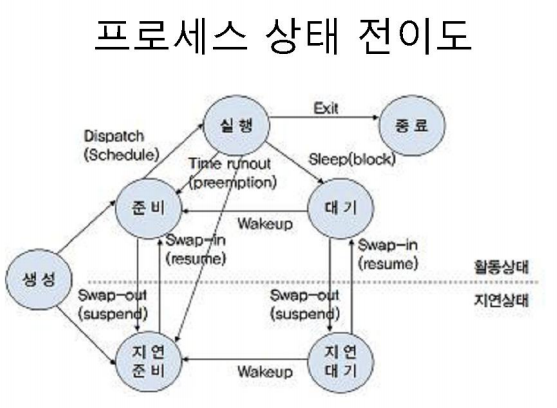

# 프로세스 상태 및 상태 전이

## 1. 프로세스 상태

### 1.1 생성 (Created)
- **설명**: 커널 공간에서 PCB(Process Control Block) 등의 정보가 생성되고, 프로세스가 처음으로 생성되는 상태입니다.

### 1.2 준비 (Ready)
- **설명**: 기억 장치 등 필요한 모든 자원을 할당받은 상태에서, 프로세서는 대기 상태로 프로세서를 할당받으려고 기다리고 있습니다. 즉, 프로세서를 할당받으면 즉시 실행이 가능한 상태입니다.

### 1.3 실행 (Running)
- **설명**: 프로그램 코드가 프로세서에 의해 실행되고 있는 상태입니다. 프로세스는 필요한 모든 자원을 할당받은 상태입니다.

### 1.4 대기 (Blocked)
- **설명**: 프로세스가 필요한 자원을 요청하고 이를 할당받을 때까지 기다리는 상태입니다. 주로 실행 도중 I/O 요청에 의해 프로세스가 중단된 상태입니다.

### 1.5 지연 준비 (Suspended Ready)
- **설명**: 프로세스가 기억 장치를 제외한 다른 모든 자원들을 보유한 상태입니다. 이 상태에서는 기억 장치가 할당되지 않은 상태입니다.

### 1.6 지연 대기 (Suspended Blocked)
- **설명**: 프로세스가 대기 상태에서 기억 장치를 잃은 상태입니다. 이 상태에서는 프로세스가 자원을 기다리면서도 기억 장치를 할당받지 못한 상태입니다.

### 1.7 종료 (Exit)
- **설명**: 프로세스의 실행을 종료하였으나, 아직 프로세스에 대한 정보가 남아있는 상태입니다. 이 상태는 **Zombie 상태**라고도 불립니다.

## 2. 프로세스 상태 전이

### 2.1 디스패치 (Dispatch) 또는 스케줄 (Schedule)
- **설명**: 준비 상태에서 프로세서를 할당받아 실행 상태로 전이하는 이벤트입니다.

### 2.2 선점 (Preemption) 또는 Time Runout
- **설명**: 실행 상태의 프로세스가 프로세서 시간 할당량이 끝났거나, 우선순위가 높은 프로세스가 들어왔을 때 프로세서를 반납하고 준비 상태로 전이되는 이벤트입니다.

### 2.3 대기 (Block)
- **설명**: 실행 상태의 프로세스가 자원을 요청하여 대기 상태로 전이되는 이벤트입니다.

### 2.4 웨이크업 (Wakeup)
- **설명**: 대기(지연 대기) 상태에서 프로세스가 요청한 자원이 할당되어 준비(지연 준비) 상태로 전이되는 이벤트입니다.

### 2.5 스왑 인 (Swap-in) 또는 재활동 (Resume)
- **설명**: 지연 준비(지연 대기) 상태에서 기억 장치를 할당받아 준비(대기) 상태로 전이되는 이벤트입니다.

### 2.6 스왑 아웃 (Swap-out) 또는 지연 (Suspend)
- **설명**: 지연 대기 상태에서 기억 장치를 잃고 지연 준비(지연 대기) 상태로 전이되는 이벤트입니다.

## 참고
[리눅스] 프로세스 상태 전이도 - 작성자 자바킹
