# Qt
### 순서
1. [예제1](#예제1)
2. [Tab1](#tab1)
    - [dial 값에 따라 led 빛내기](#dial-값에-따라-led-빛내기)
    - [TimerStart 버튼](#timerstart-버튼)
    - [Timer중에 ComboBox 변경](#timer중에-combobox-변경)
    - [checkbox 와 led](#checkbox-와-led)
3. [Tab2](#tab2)
    - [tab 시작 바꾸기](#tab-시작-바꾸기)
    - [서버 소켓 연결](#서버-소켓-연결)
    - [메세지 송신](#메세지-송신)
    - [메세지 분리](#메세지-분리)
    - [LED 적용](#led-적용)
    - [SETDIAL](#setdial-구현)
4. [Tab3](#tab3)
    - [Tab3 ui 적용](#tab3-ui-적용)
    - [버튼으로 LAMP ON/OFF](#버튼으로-lamp-onoff)

### 예제1
#### HelloWorld 출력
```cpp
#include <QApplication>
#include <QLabel>

int main(int argc, char **argv)
{
	QApplication app(argc, argv);

	QLabel *hello = new QLabel("<font color=blue>Hello <i>World!</i></font>", 0);

	hello->resize(880,135);			/* widget size setting */
	hello->move(300,300);			/* widget location setting */ 
	hello->show();					/* widget screen display */

	return app.exec();				/* Qt event loop start */
}
```


---
### 예제 2 버튼 클릭

```cpp
// button1.cpp
#include <QApplication>
#include "CustomWidget.h"
int main(int argc, char **argv)
{
    QApplication app(argc, argv);
#if 0

    QPushButton *button = new QPushButton("Quit", 0);
    button->resize(80, 35); 		/* 위젯의 크기 설정 */
    button->move(300, 300);		/* 위젯의 위치 설정 */
    button->show(); 			/* 위젯의 화면 표시 */
    QObject::connect(button,SIGNAL(clicked()),&app,SLOT(quit()));
#endif

	CustomWidget *widget = new CustomWidget(0);
	QObject::connect(widget,SIGNAL(widgetClicked()),&app,SLOT(quit()));
	widget->show();

    return app.exec();
}

// CustomWidget.h
#ifndef __CUSTOM_WIDGET__
#define __CUSTOM_WIDGET__

#include <QWidget>

class CustomWidget : public QWidget {
		Q_OBJECT
	public:
		CustomWidget(QWidget *parent = 0);

	signals:
		void widgetClicked();
	public slots:
		void processClick();
		
};

#endif // __CUSTOM_WIDGET


// CustomWidget.cpp
#include <QApplication>
#include <QPushButton>
#include "CustomWidget.h"

CustomWidget::CustomWidget(QWidget* parent) : QWidget(parent)
{
	QPushButton *button = new QPushButton("Quit", this);
	button->resize(120,35);
	button->move(180,250);

	this->resize(300,300);
	move(300,300);

	//connect(button,SIGNAL(clicked()),qApp, SLOT(quit()));
//	connect(button,SIGNAL(clicked()),SIGNAL(widgetClicked()));
	connect(button,SIGNAL(clicked()),this,SLOT(processClick()));

}

void CustomWidget::processClick()
{
	emit widgetClicked();
}
```

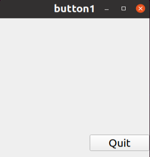

---

### 예제 3 radiobutton

```cpp
#include <QApplication>
#include <QWidget>
#include <QRadioButton>
#include <QButtonGroup>

int main(int argc, char** argv)
{
    QApplication app(argc, argv);

    QWidget *widget = new QWidget(0);
    QButtonGroup *bg = new QButtonGroup(widget);			/* 버튼 그룹 객체 생성 */
    
    QRadioButton *rb1 = new QRadioButton("Option &1", widget);		/* 라디오 버튼 객체 생성 */
    rb1->move(10, 10);
    bg->addButton(rb1);							/* 버튼 그룹에 추가 */
    
    QRadioButton *rb2 = new QRadioButton("Option &2", widget);
    rb2->move(10, 30);
    bg->addButton(rb2);
    
    QRadioButton *rb3 = new QRadioButton("Option &3", widget);
    rb3->move(10, 50);
    bg->addButton(rb3);
    
    QRadioButton *rb4 = new QRadioButton("Option &4", widget);
    rb4->move(10, 70);
    bg->addButton(rb4);
    
    widget->resize(140, 110);						/* 위젯의 크기 설정 */
    widget->show();							/* 위젯을 화면에 표시 */
    
    return app.exec();
}
```
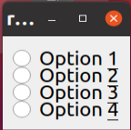
---
### 예제 4 CheckBox
```cpp
#include <QApplication>
#include <QWidget>
#include <QCheckBox>
#include <QLabel>
#include <QButtonGroup>

int main(int argc, char** argv)
{
    QApplication app(argc, argv);
    
    QWidget *widget = new QWidget(0);
    QButtonGroup *bg = new QButtonGroup(widget);
    
    QLabel *lb = new QLabel("0", widget);			/* 레이블 객체 생성 */
    lb->move(10, 10);
    
    QCheckBox *cb1 = new QCheckBox("Option &1", widget);	/* 체크 박스 객체 생성 */
    cb1->move(10, 30);
    bg->addButton(cb1, 1);
    
    QCheckBox *cb2 = new QCheckBox("Option &2", widget);
    cb2->move(10, 50);
    bg->addButton(cb2, 2);
    
    QCheckBox *cb3 = new QCheckBox("Option &3", widget);
    cb3->move(10, 70);
    bg->addButton(cb3, 3);
    
    QCheckBox *cb4 = new QCheckBox("Option &4", widget);
    cb4->move(10, 90);
    bg->addButton(cb4, 4);
    
    bg->setExclusive(false);					/* 버튼 그룹의 상호 배타 설정 해제 */
    QObject::connect(bg, SIGNAL(buttonClicked(int)), lb, SLOT(setNum(int)));
    
    widget->resize(110, 140);
    widget->show();
    
    return app.exec();
}
```
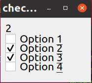
---
### 예제 5 ProgressBar
```cpp
#include <QApplication>
#include <QProgressBar>

int main(int argc, char **argv)
{
    QApplication app(argc, argv);
    
    QProgressBar *pb = new QProgressBar();		/* 프로그래스바 객체 생성 */
    pb->setRange(0, 60);
    pb->setValue(55);
    pb->show();
    
    return app.exec();
}
```

---
### 예제 6 lcdnumber

```cpp
#include <QApplication>
#include <QLCDNumber>

int main(int argc, char **argv)
{
    QApplication app(argc, argv);
    
    QWidget* widget = new QWidget(0);
    
    QLCDNumber *lcd1 = new QLCDNumber(widget);   	/* LCD 넘버 객체 생성 */
    lcd1->setSegmentStyle(QLCDNumber::Flat);		/* 세그먼트 스타일 설정 */
    lcd1->display(2014);				/* 표시할 값 설정 */
    lcd1->move(10, 10);
    
    QLCDNumber *lcd2 = new QLCDNumber(widget);
    lcd2->setSegmentStyle(QLCDNumber::Flat);
    lcd2->display(2014);
    lcd2->setHexMode();                 // 16진수로 변환
    lcd2->move(10, 40);
    
    widget->resize(120, 80);
    widget->show();
    
    return app.exec();
}
```
---
### 예제 7 vboxlayout
```cpp
#include <QApplication>
#include <QWidget>
#include <QRadioButton>
#include <QButtonGroup>
#include <QVBoxLayout>

int main(int argc, char** argv)
{
    QApplication app(argc, argv);
    
    QWidget *widget = new QWidget(0);
    
    QButtonGroup *bg = new QButtonGroup(widget);
    
    QVBoxLayout *vbl = new QVBoxLayout;		/* QVBoxLayout 객체 생성 */
    vbl->setSpacing(6);				/* 레이아웃의 간격 설정 */
    vbl->setMargin(3);				/* 레이아웃의 마진 설정 */
    
    QRadioButton *rb1 = new QRadioButton("Option 1", widget);
    bg->addButton(rb1);
    vbl->addWidget(rb1);
    
    QRadioButton *rb2 = new QRadioButton("Option 2", widget);
    bg->addButton(rb2);
    vbl->addWidget(rb2);
    
    QRadioButton *rb3 = new QRadioButton("Option 3", widget);
    bg->addButton(rb3);
    vbl->addWidget(rb3);
    
    QRadioButton *rb4 = new QRadioButton("Option 4", widget);
    bg->addButton(rb4);
    vbl->addWidget(rb4);
    
    widget->setLayout(vbl);			/* 위젯의 레이아웃으로 설정 */
    widget->show();
    
    return app.exec();
}
```
---
### 예제 8 MessageBox
```cpp
#include <QApplication>
#include <QMessageBox>
#include <stdio.h>

int main(int argc, char** argv)
{
    int button;
    QApplication app(argc, argv);
    
    button = QMessageBox::question(0, "Question", "Message", QMessageBox::Yes,
                                       QMessageBox::No, QMessageBox::Cancel);
    switch(button) {
        case QMessageBox::Yes:
            printf("Yes\n");
            app.quit();
            break;
        case QMessageBox::No:
            printf("No\n");
            break;
        case QMessageBox::Cancel:
            printf("Cancel\n");
            break;
    };
    
    return app.exec();
}
```
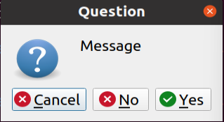
---
## Tab1

### dial 값에 따라 led 빛내기

## 테스트


```cpp
MainWidget::MainWidget(QWidget *parent)
    : QWidget(parent)
    , ui(new Ui::MainWidget)
{
    ui->setupUi(this);
    pTab1DevControl = new Tab1DevControl(ui->pTab1);
    ui->pTab1->setLayout(pTab1DevControl->layout()); // adjust size

}
```

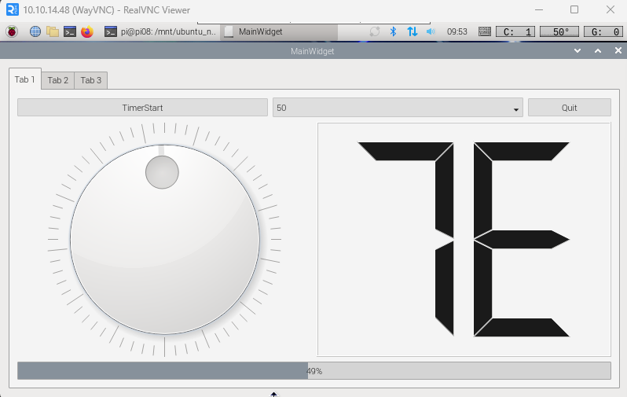

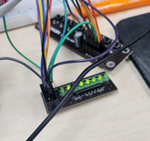
- ui에서 pTab1이라는 객체 안에서 따로 ui를 설정

### tab1devcontrol.cpp

```cpp
Tab1DevControl::Tab1DevControl(QWidget *parent) :
    QWidget(parent),
    ui(new Ui::Tab1DevControl)
{
    ui->setupUi(this);
    pKeyLed = new KeyLed(this);

    connect(ui->pDialLed,SIGNAL(valueChanged(int)),pKeyLed, SLOT(writeLedData(int)));
}

Tab1DevControl::~Tab1DevControl()
{
    delete ui;
}
```
### Dial : valueChanged(int) 값에 따라 pKeyLed 값에 변동
---

### Quit 클릭

클릭 했을 때 프로그램이 꺼지도록 설정
```cpp
void Tab1DevControl::on_pPBQuit_clicked()
{
    qApp->quit();
}
```

### TimerStart 버튼
```cpp
void Tab1DevControl::on_pPBtimerStart_clicked(bool checked)
{
    if(checked)
    {
        QString strValue = ui->pCBtimerValue->currentText();
        pQTimer->start(strValue.toInt());
        ui->pPBtimerStart->setText("TimerStop");
    }
    else
    {
        ui->pPBtimerStart->setText("TimerStart");
        pQTimer->stop();
    }
}

connect(pQTimer, SIGNAL(timeout()),this,SLOT(setValueDialSlot())); // 이거로 설정

void Tab1DevControl::setValueDialSLot() // 이거로 증가
{
    int dialValue = ui->pDialLed->value();

    if(dialValue >= ui->pDialLed->maximum())
        dialValue = 0;
    else
        dialValue++;
    ui->pDialLed->setValue(dialValue);
}
```

### Timer중에 ComboBox 변경

```cpp
void Tab1DevControl::on_pCBtimerValue_currentTextChanged(const QString &arg1)
{
    if(pQTimer->isActive())
    {
        pQTimer->stop();
        pQTimer->start(arg1.toInt()); // 종료했다가 다시 설정한 타이머값으로 바꾸기
    }
}
```

### grid layout 안에 checkbox

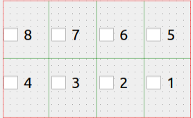


### checkbox 와 led

```cpp
//헤더파일


//
arrCnt = sizeof(pQCheckBoxArray)/sizeof(pQCheckBoxArray[0]);
pQButtonGroup = new QButtonGroup(this);
for(int i=0;i<ui->pGridLayoutKey->rowCount();i++)
{
    for(int j=0;j<ui->pGridLayoutKey->columnCount();j++)
    {
        pQCheckBoxArray[itemCnt--] = dynamic_cast<QCheckBox*>(ui->pGridLayoutKey->itemAtPosition(i,j)->widget());
    }
}
for(int i =0;i<8;i++)
{
    pQButtonGroup->addButton(pQCheckBoxArray[i],0x01 << i);
}
pQButtonGroup->setExclusive(false);
connect(pQButtonGroup, SIGNAL(buttonClicked(int)), this, SLOT(keyCheckKeyboardSlot(int)));
connect(pKeyLed,SIGNAL(updateKeyDateSig(int)),this,SLOT(keyCheckBoxSlot(int)));


void Tab1DevControl::keyCheckBoxSlot(int key)
{
    lcdData ^= key;
    ui->pLcdNumberKey->display(lcdData);
    pKeyLed->writeLedData(lcdData);

    for(int i=0;i<arrCnt;i++)
    {
        if(key == 0x01 << i)
        {
            if(pQCheckBoxArray[i]->isChecked())
                pQCheckBoxArray[i]->setChecked(false);
            else
                pQCheckBoxArray[i]->setChecked(true);
        }
    }
}

void Tab1DevControl::keyCheckKeyboardSlot(int keyno)
{
    lcdData ^= keyno;
    ui->pLcdNumberKey->display(lcdData);
    pKeyLed->writeLedData(lcdData);
}
```
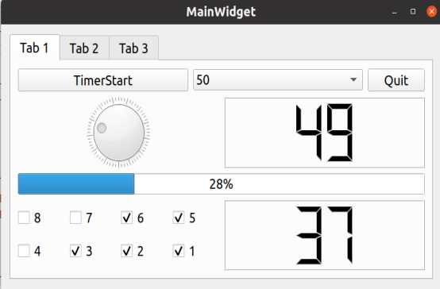
## **Tab2**
### tab 시작 바꾸기
```cpp
ui->pTabWidget->setCurrentIndex(1); // tab 시작부분 변경
```


### 서버 소켓 연결
```cpp
// tab2socketclient.h 파일
#include "socketclient.h"

SocketClient *pSocketCLient;
```
```cpp
// tab2socketclient.cpp 파일
tab2socketclient::tab2socketclient(QWidget *parent) :
    QWidget(parent),
    ui(new Ui::tab2socketclient)
{
    ui->setupUi(this);
    pSocketCLient = new SocketClient(this);
    ui->pPBsendButton->setEnabled(false);
    connect(pSocketCLient,SIGNAL(sigSocketRecv(QString)),this,SLOT(socketRecvUpdateSlot(QString)));
}


tab2socketclient::~tab2socketclient()
{
    delete ui;
}

void tab2socketclient::on_pPBservConnect_clicked(bool checked)
{
    bool bOK;
    if(checked)
    {
        pSocketCLient->slotConnectToServer(bOK);
        if(bOK)
        {
            ui->pPBservConnect->setText("서버 해제");
            ui->pPBsendButton->setEnabled(true);
        }
    }
    else
    {
        pSocketCLient->slotClosedByServer();
        ui->pPBservConnect->setText("서버 연결");
        ui->pPBsendButton->setEnabled(false);
    }
}

void tab2socketclient::socketRecvUpdateSlot(QString strRecvData)
{
    strRecvData.chop(1); // '\n' 제거
    ui->pTErecvData->append(strRecvData);
}

```
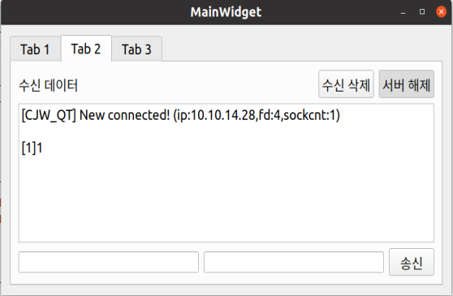


## QTime 추가
```cpp
#include <QTime>
```

```cpp
// tab2socketclient.cpp
void tab2socketclient::socketRecvUpdateSlot(QString strRecvData)
{
    QTime time = QTime::currentTime(); 
    QString strTime = time.toString();
    strRecvData.chop(1);
    strTime = strTime + " " + strRecvData;
    ui->pTErecvData->append(strTime);
}
```
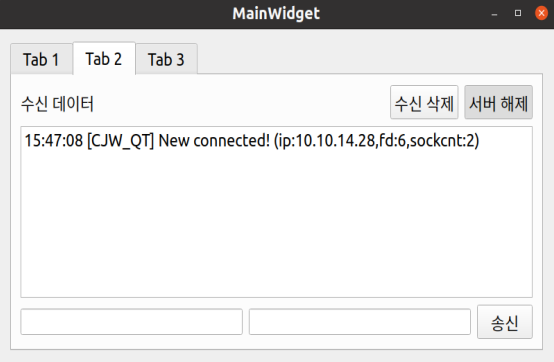
 ---
## 메세지 송신

```cpp
void tab2socketclient::on_pPBsendButton_clicked()
{
    QString strRecvId = ui->PLErecvid->text();
    QString strSendData = ui->PLEsendData->text();
    if(!strSendData.isEmpty())
    {
        if(strRecvId.isEmpty())
            strSendData = "[ALLMSG]" + strSendData;
        else
            strSendData = "["+strRecvId+"]"+strSendData;
        pSocketCLient->slotSocketSendData(strSendData);
        ui->PLEsendData->clear();
    }
}
```
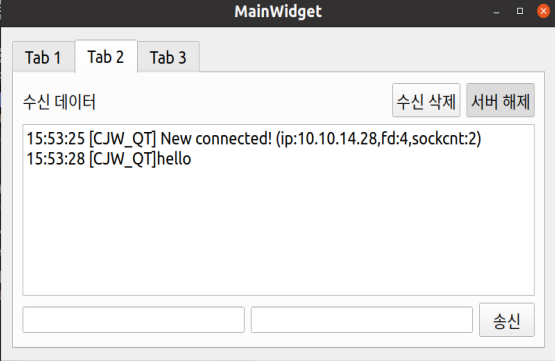

## 메세지 분리

```cpp
// tab2socketclient.h SIGNAL 추가
signals:
    void ledWriteSig(int);
```
```cpp
// tab2socketclient.cpp에 메세지 분리 추가
void tab2socketclient::socketRecvUpdateSlot(QString strRecvData)
{
    QTime time = QTime::currentTime();
    QString strTime = time.toString();
    strRecvData.chop(1);
    strTime = strTime + " " + strRecvData;
    ui->pTErecvData->append(strTime);
    strRecvData.replace("[","@");
    strRecvData.replace("]","@"); // @CJW_QT@LED@0xff
    QStringList qList = strRecvData.split("@");
    if(qList[2].indexOf("LED") == 0)    // LED는 2nd value
    {
        bool bOk;
        int ledNo = qList[3].toInt(&bOk,16);    // qList[3] = 0xff
        if(bOk)
            emit ledWriteSig(ledNo);
    }
}
```
## LED 적용
```cpp
// mainwidget에 connect 추가
connect(pTab2SocketClient,SIGNAL(ledWriteSig(int)), pTab1DevControl->pKeyLed,SLOT(wirteLedData(int)));
```
하지만<span style = "color:yellow"> pKeyLed는 private </span>이므로 get함수 적용

```cpp
//tab1devcontrol.h 파일에서
public:
    explicit Tab1DevControl(QWidget *parent = nullptr);
    ~Tab1DevControl();
    KeyLed * getpKeyLed(); // << 추가

```
```cpp
KeyLed * Tab1DevControl::getpKeyLed()
{
    return pKeyLed;
}
```

## SETDIAL 구현
- Tab1DevControl.h
```cpp
#include <QDial>

QDial * getpDial();

signals:
    void LedDataSend(int);
```
- Tab1DevControl.cpp
```cpp
void Tab1DevControl::setValueDialSlot()
{
    int dialValue = ui->pDialLed->value();
    if(dialValue >= ui->pDialLed->maximum())
        dialValue = 0;
    else
        dialValue++;
    ui->pDialLed->setValue(dialValue);
    emit
        LedDataSend(dialValue);
}

QDial * Tab1DevControl::getpDial()
{
    return ui->pDialLed;
}
```
- Tab2socketclient.cpp
```cpp
void tab2socketclient::socketRecvUpdateSlot(QString strRecvData)
{
    QTime time = QTime::currentTime();
    QString strTime = time.toString();
    strRecvData.chop(1);
    strTime = strTime + " " + strRecvData;
    ui->pTErecvData->append(strTime);
    strRecvData.replace("[","@");
    strRecvData.replace("]","@");
    QStringList qList = strRecvData.split("@");
    if(qList[2].indexOf("LED") == 0)
    {
        bool bOk;
        int ledNo = qList[3].toInt(&bOk,16);
        if(bOk)
            emit ledWriteSig(ledNo);
    }
    else if(qList[2].indexOf("SETDIAL") == 0) // SETDIAL 메세지 처리
    {
        int dialNo = qList[3].toInt();
        emit setDialValueSig(dialNo);
    }
}

void tab2socketclient::slotSocketSendDataDial(int dialValue) // dial값 보내기
{
    QString strValue = "[CJW_PI]SETDIAL@"+QString::number(dialValue);
    pSocketCLient->slotSocketSendData(strValue);
}
```
- Tab2socketclient.h
```cpp
private slots:
    void slotSocketSendDataDial(int);
signals:
    void setDialValueSig(int);
    void ledWriteSig(int);
```

## Tab3

### Tab3 ui 적용
- MainWidget.h
```cpp
class MainWidget : public QWidget
{
    Q_OBJECT

public:
    MainWidget(QWidget *parent = nullptr);
    ~MainWidget();
private:
    Ui::MainWidget *ui;
    Tab1DevControl *pTab1DevControl;
    tab2socketclient *pTab2SocketClient;
    Tab3ControlPannel *pTab3ControlPannel; // 추가
};
#endif // MAINWIDGET_H
```
- MainWidget.cpp
```cpp
pTab3ControlPannel = new Tab3ControlPannel(ui->pTab3);
ui->pTab3->setLayout(pTab3ControlPannel->layout());

ui->pTabWidget->setCurrentIndex(2); // Tab3 에서 시작
```

- ### icon 사진 적용
    - Tab3controlPannel.ui

```
New File -> Qt(Resource) -> Add Prefix에서 준비한 이미지들 넣기
```
1. #### Resource 적용 
    
    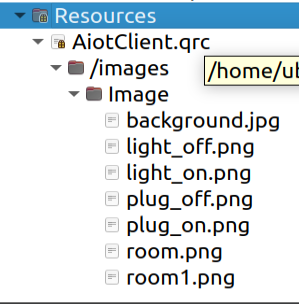


2. #### Tab3ControlPannel.ui에서 pixmap에 사진 넣기
    

3. #### 버튼에 icon 적용

    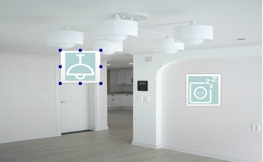


### 버튼으로 LAMP ON/OFF

- tab3controlpannel.cpp
```cpp
void Tab3ControlPannel::on_pPBLamp_clicked(bool checked)
{
    if(checked)
    {
        emit socketSendDataSig("[HM_CON]LAMPON");
    }
    else
    {
        emit socketSendDataSig("[HM_CON]LAMPOFF");
    }
}

void Tab3ControlPannel::on_pPBPlug_clicked(bool checked)
{
    if(checked)
    {
        emit socketSendDataSig("[HM_CON]GASON");
    }
    else
    {
        emit socketSendDataSig("[HM_CON]GASOFF");
    }
}

---------------------------------------------------------------------

void Tab3ControlPannel::tab3RecvDataSlot(QString recvData)
{
    QStringList qList = recvData.split("@");        //@CJW_QT@LAMPON
    if(qList[2] == "LAMPON")
    {
        ui->pPBLamp->setIcon(QIcon(":/images/Image/light_on.png"));
    }
    else if(qList[2] == "LAMPOFF")
    {
        ui->pPBLamp->setIcon(QIcon(":/images/Image/light_off.png"));
    }
    else if(qList[2] == "GASON")
    {
        ui->pPBPlug->setIcon(QIcon(":/images/Image/plug_on.png"));
    }
    else if(qList[2] == "GASOFF")
    {
        ui->pPBPlug->setIcon(QIcon(":/images/Image/plug_off.png"));
    }
}
```
- tab3controlpannel.h
```cpp
signals:
    void socketSendDataSig(QString);        // 추가
private slots:
    void on_pPBLamp_clicked(bool checked);
    void tab3RecvDataSlot(QString);         // 추가
    void on_pPBPlug_clicked(bool checked);
```

- MainWidget.cpp
```cpp
connect(pTab3ControlPannel,SIGNAL(socketSendDataSig(QString)),pTab2SocketClient->getpSocketClient(),SLOT(slotSocketSendData(QString)));
// 클릭시 메세지보내고 -> 메세지 처리하도록 함(Socket.cpp 함수)
connect(pTab2SocketClient,SIGNAL(tab3RecvDataSig(QString)),pTab3ControlPannel,SLOT(tab3RecvDataSlot(QString)));
// 서버에서 받은 메세지 -> 아이콘 바꾸기
```

- Tab2SocketClient.cpp
```cpp
void tab2socketclient::socketRecvUpdateSlot(QString strRecvData)
{
    QTime time = QTime::currentTime();
    QString strTime = time.toString();
    strRecvData.chop(1);
    strTime = strTime + " " + strRecvData;
    ui->pTErecvData->append(strTime);
    strRecvData.replace("[","@");
    strRecvData.replace("]","@");
    QStringList qList = strRecvData.split("@");
    if(qList[2].indexOf("LED") == 0)
    {
        bool bOk;
        int ledNo = qList[3].toInt(&bOk,16);
        if(bOk)
            emit ledWriteSig(ledNo);
    }
    else if(qList[2].indexOf("SETDIAL") == 0)
    {
        int dialNo = qList[3].toInt();
        emit setDialValueSig(dialNo);
    }
    else if((qList[2].indexOf("LAMP") == 0) || (qList[2].indexOf("GAS") == 0))
    {
        emit tab3RecvDataSig(strRecvData);
    }
}


SocketClient * tab2socketclient::getpSocketClient()
{
    return pSocketCLient;
}

```
- Tab2SocketClient.h
```cpp
public:
    explicit tab2socketclient(QWidget *parent = nullptr);
    ~tab2socketclient();
    SocketClient * getpSocketClient();  // 추가
signals:
    void ledWriteSig(int);
    void setDialValueSig(int);
    void tab3RecvDataSig(QString);  // 추가
```

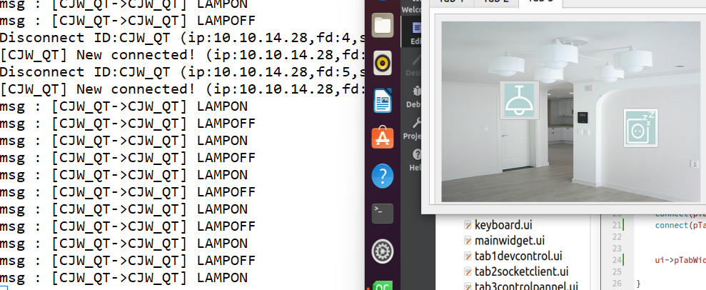

### 