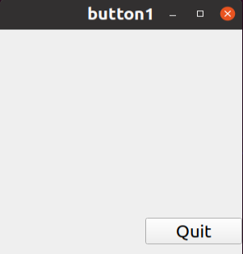
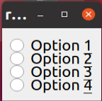
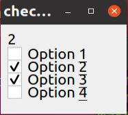
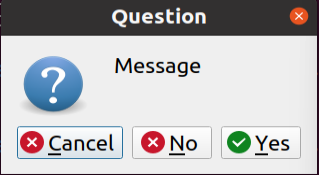
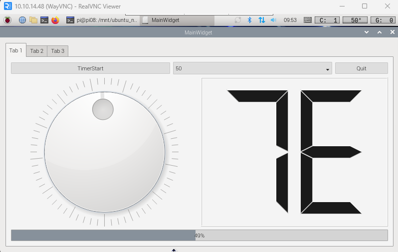
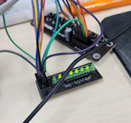
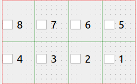

# Qt

### 예제 1 HelloWorld 출력
```cpp
#include <QApplication>
#include <QLabel>

int main(int argc, char **argv)
{
	QApplication app(argc, argv);

	QLabel *hello = new QLabel("<font color=blue>Hello <i>World!</i></font>", 0);

	hello->resize(880,135);			/* widget size setting */
	hello->move(300,300);			/* widget location setting */ 
	hello->show();					/* widget screen display */

	return app.exec();				/* Qt event loop start */
}
```


---
### 예제 2 버튼 클릭

```cpp
// button1.cpp
#include <QApplication>
#include "CustomWidget.h"
int main(int argc, char **argv)
{
    QApplication app(argc, argv);
#if 0

    QPushButton *button = new QPushButton("Quit", 0);
    button->resize(80, 35); 		/* 위젯의 크기 설정 */
    button->move(300, 300);		/* 위젯의 위치 설정 */
    button->show(); 			/* 위젯의 화면 표시 */
    QObject::connect(button,SIGNAL(clicked()),&app,SLOT(quit()));
#endif

	CustomWidget *widget = new CustomWidget(0);
	QObject::connect(widget,SIGNAL(widgetClicked()),&app,SLOT(quit()));
	widget->show();

    return app.exec();
}

// CustomWidget.h
#ifndef __CUSTOM_WIDGET__
#define __CUSTOM_WIDGET__

#include <QWidget>

class CustomWidget : public QWidget {
		Q_OBJECT
	public:
		CustomWidget(QWidget *parent = 0);

	signals:
		void widgetClicked();
	public slots:
		void processClick();
		
};

#endif // __CUSTOM_WIDGET


// CustomWidget.cpp
#include <QApplication>
#include <QPushButton>
#include "CustomWidget.h"

CustomWidget::CustomWidget(QWidget* parent) : QWidget(parent)
{
	QPushButton *button = new QPushButton("Quit", this);
	button->resize(120,35);
	button->move(180,250);

	this->resize(300,300);
	move(300,300);

	//connect(button,SIGNAL(clicked()),qApp, SLOT(quit()));
//	connect(button,SIGNAL(clicked()),SIGNAL(widgetClicked()));
	connect(button,SIGNAL(clicked()),this,SLOT(processClick()));

}

void CustomWidget::processClick()
{
	emit widgetClicked();
}
```



---

### 예제 3 radiobutton

```cpp
#include <QApplication>
#include <QWidget>
#include <QRadioButton>
#include <QButtonGroup>

int main(int argc, char** argv)
{
    QApplication app(argc, argv);

    QWidget *widget = new QWidget(0);
    QButtonGroup *bg = new QButtonGroup(widget);			/* 버튼 그룹 객체 생성 */
    
    QRadioButton *rb1 = new QRadioButton("Option &1", widget);		/* 라디오 버튼 객체 생성 */
    rb1->move(10, 10);
    bg->addButton(rb1);							/* 버튼 그룹에 추가 */
    
    QRadioButton *rb2 = new QRadioButton("Option &2", widget);
    rb2->move(10, 30);
    bg->addButton(rb2);
    
    QRadioButton *rb3 = new QRadioButton("Option &3", widget);
    rb3->move(10, 50);
    bg->addButton(rb3);
    
    QRadioButton *rb4 = new QRadioButton("Option &4", widget);
    rb4->move(10, 70);
    bg->addButton(rb4);
    
    widget->resize(140, 110);						/* 위젯의 크기 설정 */
    widget->show();							/* 위젯을 화면에 표시 */
    
    return app.exec();
}
```

---
### 예제 4 CheckBox
```cpp
#include <QApplication>
#include <QWidget>
#include <QCheckBox>
#include <QLabel>
#include <QButtonGroup>

int main(int argc, char** argv)
{
    QApplication app(argc, argv);
    
    QWidget *widget = new QWidget(0);
    QButtonGroup *bg = new QButtonGroup(widget);
    
    QLabel *lb = new QLabel("0", widget);			/* 레이블 객체 생성 */
    lb->move(10, 10);
    
    QCheckBox *cb1 = new QCheckBox("Option &1", widget);	/* 체크 박스 객체 생성 */
    cb1->move(10, 30);
    bg->addButton(cb1, 1);
    
    QCheckBox *cb2 = new QCheckBox("Option &2", widget);
    cb2->move(10, 50);
    bg->addButton(cb2, 2);
    
    QCheckBox *cb3 = new QCheckBox("Option &3", widget);
    cb3->move(10, 70);
    bg->addButton(cb3, 3);
    
    QCheckBox *cb4 = new QCheckBox("Option &4", widget);
    cb4->move(10, 90);
    bg->addButton(cb4, 4);
    
    bg->setExclusive(false);					/* 버튼 그룹의 상호 배타 설정 해제 */
    QObject::connect(bg, SIGNAL(buttonClicked(int)), lb, SLOT(setNum(int)));
    
    widget->resize(110, 140);
    widget->show();
    
    return app.exec();
}
```

---
### 예제 5 ProgressBar
```cpp
#include <QApplication>
#include <QProgressBar>

int main(int argc, char **argv)
{
    QApplication app(argc, argv);
    
    QProgressBar *pb = new QProgressBar();		/* 프로그래스바 객체 생성 */
    pb->setRange(0, 60);
    pb->setValue(55);
    pb->show();
    
    return app.exec();
}
```

---
### 예제 6 lcdnumber

```cpp
#include <QApplication>
#include <QLCDNumber>

int main(int argc, char **argv)
{
    QApplication app(argc, argv);
    
    QWidget* widget = new QWidget(0);
    
    QLCDNumber *lcd1 = new QLCDNumber(widget);   	/* LCD 넘버 객체 생성 */
    lcd1->setSegmentStyle(QLCDNumber::Flat);		/* 세그먼트 스타일 설정 */
    lcd1->display(2014);				/* 표시할 값 설정 */
    lcd1->move(10, 10);
    
    QLCDNumber *lcd2 = new QLCDNumber(widget);
    lcd2->setSegmentStyle(QLCDNumber::Flat);
    lcd2->display(2014);
    lcd2->setHexMode();                 // 16진수로 변환
    lcd2->move(10, 40);
    
    widget->resize(120, 80);
    widget->show();
    
    return app.exec();
}
```
---
### 예제 7 vboxlayout
```cpp
#include <QApplication>
#include <QWidget>
#include <QRadioButton>
#include <QButtonGroup>
#include <QVBoxLayout>

int main(int argc, char** argv)
{
    QApplication app(argc, argv);
    
    QWidget *widget = new QWidget(0);
    
    QButtonGroup *bg = new QButtonGroup(widget);
    
    QVBoxLayout *vbl = new QVBoxLayout;		/* QVBoxLayout 객체 생성 */
    vbl->setSpacing(6);				/* 레이아웃의 간격 설정 */
    vbl->setMargin(3);				/* 레이아웃의 마진 설정 */
    
    QRadioButton *rb1 = new QRadioButton("Option 1", widget);
    bg->addButton(rb1);
    vbl->addWidget(rb1);
    
    QRadioButton *rb2 = new QRadioButton("Option 2", widget);
    bg->addButton(rb2);
    vbl->addWidget(rb2);
    
    QRadioButton *rb3 = new QRadioButton("Option 3", widget);
    bg->addButton(rb3);
    vbl->addWidget(rb3);
    
    QRadioButton *rb4 = new QRadioButton("Option 4", widget);
    bg->addButton(rb4);
    vbl->addWidget(rb4);
    
    widget->setLayout(vbl);			/* 위젯의 레이아웃으로 설정 */
    widget->show();
    
    return app.exec();
}
```
---
### 예제 8 MessageBox
```cpp
#include <QApplication>
#include <QMessageBox>
#include <stdio.h>

int main(int argc, char** argv)
{
    int button;
    QApplication app(argc, argv);
    
    button = QMessageBox::question(0, "Question", "Message", QMessageBox::Yes,
                                       QMessageBox::No, QMessageBox::Cancel);
    switch(button) {
        case QMessageBox::Yes:
            printf("Yes\n");
            app.quit();
            break;
        case QMessageBox::No:
            printf("No\n");
            break;
        case QMessageBox::Cancel:
            printf("Cancel\n");
            break;
    };
    
    return app.exec();
}
```

---
### 예제 9 dial 값에 따라 led 빛내기


```cpp
MainWidget::MainWidget(QWidget *parent)
    : QWidget(parent)
    , ui(new Ui::MainWidget)
{
    ui->setupUi(this);
    pTab1DevControl = new Tab1DevControl(ui->pTab1);
    ui->pTab1->setLayout(pTab1DevControl->layout()); // adjust size

}
```




- ui에서 pTab1이라는 객체 안에서 따로 ui를 설정

### tab1devcontrol.cpp

```cpp
Tab1DevControl::Tab1DevControl(QWidget *parent) :
    QWidget(parent),
    ui(new Ui::Tab1DevControl)
{
    ui->setupUi(this);
    pKeyLed = new KeyLed(this);

    connect(ui->pDialLed,SIGNAL(valueChanged(int)),pKeyLed, SLOT(writeLedData(int)));
}

Tab1DevControl::~Tab1DevControl()
{
    delete ui;
}
```
### Dial : valueChanged(int) 값에 따라 pKeyLed 값에 변동
---

### Quit 클릭

클릭 했을 때 프로그램이 꺼지도록 설정
```cpp
void Tab1DevControl::on_pPBQuit_clicked()
{
    qApp->quit();
}
```

### TimerStart 버튼
```cpp
void Tab1DevControl::on_pPBtimerStart_clicked(bool checked)
{
    if(checked)
    {
        QString strValue = ui->pCBtimerValue->currentText();
        pQTimer->start(strValue.toInt());
        ui->pPBtimerStart->setText("TimerStop");
    }
    else
    {
        ui->pPBtimerStart->setText("TimerStart");
        pQTimer->stop();
    }
}

connect(pQTimer, SIGNAL(timeout()),this,SLOT(setValueDialSlot())); // 이거로 설정

void Tab1DevControl::setValueDialSLot() // 이거로 증가
{
    int dialValue = ui->pDialLed->value();

    if(dialValue >= ui->pDialLed->maximum())
        dialValue = 0;
    else
        dialValue++;
    ui->pDialLed->setValue(dialValue);
}
```

### Timer중에 ComboBox 변경

```cpp
void Tab1DevControl::on_pCBtimerValue_currentTextChanged(const QString &arg1)
{
    if(pQTimer->isActive())
    {
        pQTimer->stop();
        pQTimer->start(arg1.toInt()); // 종료했다가 다시 설정한 타이머값으로 바꾸기
    }
}
```

### grid layout 안에 checkbox



