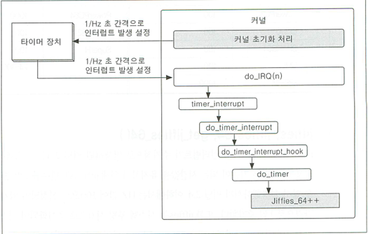

1. [p86_mknod](#p86_mknod)
2. [p106_hello](#p106_hello)
3. [p106_ledkey](#p106_ledkey)
4. [p122_param_ledkey](#p122_param_ledkey)
5. [p184_calldev](#p184_calldev)
6. [p335_kerneltimer_dev](#p335_kerneltimer_dev)
7. [p432_ledkey_poll](#p432_ledkey_poll)

---


# [p86_mknod](./drivers/p86_mknod/mknod.c)

이 프로젝트는 리눅스에서 `mknod()` 시스템 호출을 사용하여 문자형 디바이스 노드를 생성하고, 이를 통해 디바이스를 열고 읽기/쓰기 작업을 수행하는 예제를 제공합니다.

## 개요

`mknod.c` 파일은 디바이스 노드를 생성하고 해당 디바이스를 열어 기본적인 파일 작업을 수행하는 방법을 다룹니다. 이 코드는 리눅스 환경에서 디바이스 노드를 처리하고, 시스템 호출을 사용하는 방법을 이해하는 데 도움이 됩니다.

## 파일 구조
```c
p86_mknod/ # 프로젝트 폴더
├── mknod.c # 디바이스 노드 생성 및 파일 작업 예제
└── README.md # 이 문서
```

# [p106_hello](./drivers/p106/hello.c)

이 프로젝트는 리눅스 커널 모듈을 작성하는 예제로, `hello.c` 파일을 통해 간단한 커널 모듈을 초기화하고 종료하는 방법을 소개합니다.

## 개요

`hello.c` 파일은 리눅스 커널 모듈의 기본 구조를 보여주며, 모듈이 로드될 때 "This is Test World"라는 메시지를 출력하고, 모듈이 언로드될 때 "Goodbye, world"라는 메시지를 출력하는 기능을 수행합니다. 이 예제는 리눅스 커널 모듈의 작성, 초기화, 종료 절차를 이해하는 데 유용합니다.

## 코드 설명

- `hello_init()` 함수는 모듈이 로드될 때 호출되며, `printk()`를 사용해 커널 로그에 메시지를 출력합니다.
- `hello_exit()` 함수는 모듈이 언로드될 때 호출되며, "Goodbye, world"라는 메시지를 출력합니다.
- `module_init(hello_init)` 매크로는 모듈이 로드될 때 `hello_init()` 함수를 호출하도록 설정합니다.
- `module_exit(hello_exit)` 매크로는 모듈이 언로드될 때 `hello_exit()` 함수를 호출하도록 설정합니다.

## 파일 구조
```c
p106/ # 프로젝트 폴더
├── hello.c  # 리눅스 커널 모듈 예제
└── README.md # 이 문서
```

# [p106_ledkey](./drivers/p106_ledkey/hello_ledkey.c)

이 프로젝트는 리눅스 커널 모듈을 사용하여 GPIO 핀을 통해 LED와 키의 상태를 제어하는 예제입니다. `hello_ledkey.c` 파일은 여러 개의 GPIO 핀을 이용해 LED를 제어하고, 키 입력 값을 읽어 이를 LED에 반영하는 기능을 구현합니다.

## 개요

`hello_ledkey.c` 파일은 리눅스 커널 모듈에서 GPIO를 사용하여 LED와 키를 제어하는 방법을 소개합니다. 이 예제는 GPIO의 초기화, 설정, 데이터 읽기 및 쓰기 작업을 수행하며, 키의 상태에 따라 LED를 제어하는 방식으로 동작합니다.

### 주요 기능
- **LED 제어**: GPIO 핀을 사용하여 LED를 제어합니다. `gpioLedSet()` 함수는 입력 값에 따라 LED를 켜거나 끄는 역할을 합니다.
- **키 입력 읽기**: 여러 개의 GPIO 핀을 입력으로 설정하고, `gpioKeyGet()` 함수로 각 키의 상태를 읽습니다.
- **GPIO 초기화 및 해제**: `gpioLedInit()`와 `gpioKeyInit()` 함수는 각각 LED와 키의 GPIO 핀을 초기화하고, `gpioLedFree()`와 `gpioKeyFree()` 함수는 자원을 해제합니다.

## 코드 설명

- **hello_init()**:
  - 모듈이 로드될 때 호출되며, 키의 상태를 읽고, 이를 기반으로 LED를 제어합니다.
  - `gpioKeyInit()` 함수로 키를 초기화하고, `gpioKeyGet()` 함수로 키 값을 읽습니다.
  - LED를 초기화하고, 읽은 키 값을 LED에 반영한 후, LED와 키를 해제합니다.

- **hello_exit()**:
  - 모듈이 언로드될 때 호출되며, `hello_init()`에서 했던 작업을 반복하여 종료 시 LED 상태를 설정하고 GPIO 자원을 해제합니다.

- **gpioLedInit()**:
  - LED를 제어하기 위해 GPIO 핀을 출력으로 설정하고 초기화합니다.
  
- **gpioLedSet()**:
  - 키의 상태에 따라 LED를 설정하는 함수로, 8개의 LED를 각 키에 대응하여 켜거나 끕니다.

- **gpioLedFree()**:
  - LED GPIO 핀을 해제합니다.

- **gpioKeyInit()**:
  - 키 GPIO 핀을 입력으로 설정하고 초기화합니다.

- **gpioKeyGet()**:
  - 각 키의 상태를 읽어 8비트 값으로 반환합니다.

- **gpioKeyFree()**:
  - 키 GPIO 핀을 해제합니다.

## 파일 구조
```c
p106_ledkey/ # 프로젝트 폴더
├── hello_ledkey.c  # 리눅스 커널 모듈 예제
└── README.md # 이 문서
```


# [p122_param_ledkey](./drivers/p122_param_ledkey/hello_param_ledkey.c)

이 프로젝트는 리눅스 커널 모듈을 사용하여 GPIO 핀을 통해 LED를 제어하고, 모듈 파라미터를 활용하는 예제입니다. `hello_param_ledkey.c` 파일은 LED와 키 상태를 제어하는 기능을 제공하며, 모듈 파라미터를 사용하여 LED를 제어할 수 있는 값을 동적으로 설정합니다.

## 개요

`hello_param_ledkey.c` 파일은 리눅스 커널 모듈에서 GPIO를 사용하여 LED를 제어하고, 키 입력 값을 읽어 이를 LED에 반영하는 기능을 구현합니다. 이 예제는 모듈 파라미터(`module_param`)를 사용하여 동적으로 값을 설정하고, 이를 이용해 LED를 제어하는 방법을 설명합니다.

### 주요 기능
- **LED 제어**: GPIO 핀을 사용하여 LED를 제어합니다. `gpioLedSet()` 함수는 입력 값에 따라 LED를 켜거나 끄는 역할을 합니다.
- **키 입력 읽기**: 여러 개의 GPIO 핀을 입력으로 설정하고, `gpioKeyGet()` 함수로 각 키의 상태를 읽습니다.
- **GPIO 초기화 및 해제**: `gpioLedInit()`와 `gpioKeyInit()` 함수는 각각 LED와 키의 GPIO 핀을 초기화하고, `gpioLedFree()`와 `gpioKeyFree()` 함수는 자원을 해제합니다.
- **모듈 파라미터 사용**: `onevalue`와 `twostring` 파라미터를 사용하여 모듈을 동적으로 설정할 수 있습니다. `onevalue`는 정수 값으로 LED를 제어하고, `twostring`은 문자열 파라미터로 모듈 동작에 영향을 줍니다.

## 코드 설명

- **onevalue**: 정수 파라미터로, LED를 켤 때 사용할 값을 설정합니다. 기본 값은 `1`이며, 이를 통해 8개의 LED를 제어할 수 있습니다.
- **twostring**: 문자열 파라미터로, 모듈에서 설정된 문자열 값을 출력할 수 있습니다.
  
- **hello_init()**:
  - 모듈이 로드될 때 호출되며, `onevalue` 값과 `twostring` 값을 출력하고, LED를 초기화한 후 `onevalue` 값을 기반으로 LED를 설정합니다.

- **hello_exit()**:
  - 모듈이 언로드될 때 호출되며, LED를 끄고 GPIO 자원을 해제합니다.

- **gpioLedInit()**:
  - LED를 제어하기 위해 GPIO 핀을 출력으로 설정하고 초기화합니다.

- **gpioLedSet()**:
  - LED를 설정하는 함수로, `onevalue` 값에 따라 각 LED를 켜거나 끄는 동작을 합니다.

- **gpioLedFree()**:
  - LED GPIO 핀을 해제합니다.

- **gpioKeyInit()**:
  - 키 GPIO 핀을 입력으로 설정하고 초기화합니다.

- **gpioKeyGet()**:
  - 각 키의 상태를 읽어 8비트 값으로 반환합니다.

- **gpioKeyFree()**:
  - 키 GPIO 핀을 해제합니다.

## 파일 구조
```c
p122_param_ledkey/ # 프로젝트 폴더
├── hello_param_ledkey.c  # 리눅스 커널 모듈 예제
└── README.md # 이 문서
```

# [p184_calldev](./drivers/p184_calldev/)

이 프로젝트는 리눅스 커널 모듈을 사용하여 GPIO 핀을 통해 LED와 키 입력을 처리하는 예제입니다. `call_ledkey_dev.c` 파일은 LED 제어 및 키 입력을 위한 장치 드라이버를 구현하며, `call_ledkey_app.c` 파일은 이를 제어하는 사용자 공간 애플리케이션입니다.

## 프로젝트 개요

이 프로젝트는 다음과 같은 주요 기능을 제공합니다:

1. **LED 제어**: 8개의 GPIO 핀을 사용하여 LED의 상태를 제어합니다.
2. **키 입력 처리**: 8개의 GPIO 핀을 입력으로 사용하여 키 상태를 읽습니다.
3. **커널 모듈**: `call_ledkey_dev.c` 파일은 커널 모듈로, 사용자 공간 애플리케이션에서 LED와 키 상태를 읽고 쓸 수 있도록 합니다.
4. **사용자 애플리케이션**: `call_ledkey_app.c` 파일은 LED 값을 설정하고 키 입력 상태를 모니터링하는 기능을 합니다.

## 파일 설명

### 1. [call_ledkey_dev.c](./drivers/p184_calldev/call_dev.c) (커널 모듈)

이 파일은 커널 모듈로, LED와 키를 제어하는 드라이버를 구현합니다. 주요 함수는 다음과 같습니다:

- **GPIO 핀 초기화 및 해제**:
  - `gpioLedInit()`: LED를 제어할 GPIO 핀을 출력으로 설정합니다.
  - `gpioLedFree()`: LED GPIO 핀을 해제합니다.
  - `gpioKeyInit()`: 키 입력을 위한 GPIO 핀을 입력으로 설정합니다.
  - `gpioKeyFree()`: 키 입력 GPIO 핀을 해제합니다.

- **파일 작업 함수**:
  - `ledkey_open()`: 장치 파일을 열 때 호출됩니다.
  - `ledkey_read()`: 키 입력 값을 읽어옵니다.
  - `ledkey_write()`: LED를 설정합니다.
  - `ledkey_ioctl()`: 장치의 제어 명령을 처리합니다.
  - `ledkey_release()`: 장치 파일을 닫을 때 호출됩니다.

# [p335_kerneltimer_dev](./p335_kerneltimer_dev/)

기존에 했던 LED과 Key값을 적용시키는 부분에서 Timer를 적용시킨 예제입니다.

- **주요 코드**:
```c
static int timerVal = 100;	//timerVal=f=100HZ, T=1/100 = 10ms, 100*10ms = 1Sec

struct timer_list timerLed;

void kerneltimer_func(struct timer_list *t)
{
#if DEBUG
	printk("ledVal : %#04x\n", (unsigned int)(ledVal));
#endif
	gpioLedSet(ledVal);
	ledVal = ~ledVal & 0xff;
	mod_timer(t,get_jiffies_64() + timerVal);
}

void kerneltimer_registertimer(unsigned long timeover)
{
	timerLed.expires = get_jiffies_64() + timeover;	//10ms * 100 = 1Sec
	timer_setup(&timerLed,kerneltimer_func,0);
	add_timer(&timerLed);
}


kerneltimer_registertimer(timerVal); // 타이머 사용 선언

if(timer_pending(&timerLed))          // 타이머 종료 선언
	del_timer(&timerLed);     
```


# **시간 처리와 커널 타이머**

커널에서 시간에 따른 처리를 위해 jiffies_64라는 전역 변수를 여러 시간의 기준이 되는 시간값으로 사용하고 있다.

커널에서 HZ, USER_HZ와 같은 상수와 시간 등의 처리를 위한 do_gettimeofday(), do_settimeofday(),mktime() 같은 함수를 제공한다.


### **스케줄러(Scheduler)**
운영 체제의 핵심 구성 요소 중 하나로, 프로세스나 스레드의 실행 순서를 결정하고 자원을 효율적으로 배분하는 역할을 합니다. 리눅스 커널에서는 스케줄러가 프로세스와 스레드의 실행을 관리하며, CPU를 여러 작업에 분배하는 방식으로 시스템의 성능을 최적화합니다. 가장 많이 사용되는 알고리즘은 ***CFS*** 이다


### - CFS (Completely Fair Scheduler)
  - CFS는 리눅스 커널에서 기본적으로 사용하는 스케줄러로, 완전히 공정한 방식으로 각 프로세스에게 CPU를 분배하려고 합니다.
  - 각 프로세스는 실행을 기다리는 동안 '가상 런타임'이라는 값을 가지며, 이 값이 작은 프로세스가 우선적으로 CPU를 할당받습니다. 이는 "프로세스가 실행된 시간"에 해당하는 값입니다.
  - CFS는 우선순위 기반이 아니라, 각 프로세스가 얼마나 자주 CPU를 사용할 수 있는지에 따라 균형을 맞춥니다.

  #### `주요 역할`:
    프로세스 선택: 어떤 프로세스를 언제 실행할지 선택
    컨텍스트 스위칭: 실행 중인 프로세스를 중단하고 다른 프로세스를 실행하는 과정
    우선순위 관리: 프로세스마다 우선순위를 부여하고, 이를 기반으로 CPU를 배분
    CPU 시간 관리: 각 프로세스가 CPU를 사용하는 시간을 적절히 분배하여 효율적인 자원 관리



## jiffies, jiffies_64, ge니iffies_64( ) 

HZ 값에 의해 타이머 인터럽트가 주기적으로 발생하면 시스랩에서 공통적으로 사용될 수 있는 기준이 되는 시간값을 유지하기 위해 jiffies란 변수를 1씩 증가시킨다.

이 경우 HZ 값이 100으로 설정되어 있기 때문에 0.01초 간격으로 1씩 증가한다. 또한jiffies는 시스템 부팅 시 0으로 초기화되어 시스템이 종료될 때까지 지속적으로 증가히는데， unsigned long 타입으로 선언되어 있기 때문에 크기가 32비 
트이며 HZ가 100이면 42，948，362.25초 이후에 오버버플로우를 발생시킨다.

## 짧은 지연의 처리:
- mdelay(): 밀리초 단위의 지연
- udelay(): 마이크로초 단위의 지연
- ndelay(): 나노초 단위의 지연

## 시스템 시간과 설정
- struct timeVal: 시간 처리르 위한 구조체
- struct timespec: 시간처리를 위한 구조체(커널 2.6에 추가)
- do_gettimeofday(): 시스템 시간을 초로 얻어온다
- do_settimeofday(): 초로 환산된 시스템 시간을 설정한다
- mktime(): 날짜와 시간을 초로 바꾼다

---
#### **gpio_to_irq(gpioKey)**
```
gpio_to_irq 함수는 리눅스 커널에서 GPIO (General Purpose Input/Output) 핀을 인터럽트로 연결하는 함수입니다. 즉, GPIO 핀에 연결된 하드웨어 이벤트가 발생했을 때, 그 이벤트를 인터럽트 핸들러로 처리할 수 있도록 변환해주는 역할을 합니다.
```

#### **free_irq(irqKey)**
```
리눅스 커널에서 인터럽트를 해제하는 함수입니다. 인터럽트를 요청한 후, 더 이상 필요하지 않거나 시스템에서 종료될 때 해당 인터럽트를 해제하여 자원을 반환하는 역할을 합니다.
```

#### **irqreturn_t keyIsr(int irq, void *data);***
```c
리눅스 커널에서 인터럽트 서비스 루틴 (ISR, Interrupt Service Routine)을 정의하는 함수의 선언입니다. 이 함수는 주로 하드웨어 인터럽트를 처리하기 위해 사용됩니다.

#include <linux/interrupt.h>
#include <linux/irq.h>

irqreturn_t keyIsr(int irq, void * data)

static int irqKeyInit(void)
{
	int ret = 0;
	for(int i=0;i<GPIOCNT;i++)
    irqKey[i] = gpio_to_irq(gpioKey[i]);
	return ret;
}

static void irqKeyFree(void)
{
	for(int i=0;i<GPIOCNT;i++)
		free_irq(irqKey[i], NULL);
}

// init에 request_irq 필수
for(int i=0; i<GPIOCNT;i++)
{
  result = request_irq(irqKey[i],keyIsr,IRQF_TRIGGER_RISING,irqName[i],NULL);
  if(result <0)
    return result;
}
```
리눅스 커널에서 인터럽트 서비스 루틴(ISR)의 반환 타입으로 사용되는 타입


```c
<linux/mutex.h>

static DEFINE_MUTEX(keyMutex);

mutex_trylock(&keyMutex) != 0

mutex_init(&keyMutex);
//ex)
if(mutex_trylock(&keyMutex) != 0)
{
  keyNum = i + 1;
  mutex_unlock(&keyMutex);
	break;
}
mutex_destory(&keyMutex);
```

### kmalloc
```c
typedef struct{
	int keyNum;
	int irqKey[GPIOCNT];
} keyDataStruct;
int main()
{
  keyDataStruct *pKeyData;
  kmalloc(sizeof(keyDataStruct),GFP_KERNEL);
}
```
### **kmalloc 함수**
kmalloc은 커널 공간에서 동적으로 메모리를 할당하는 함수입니다. kmalloc은 사용자가 요청한 크기만큼 메모리를 할당하고, 성공하면 해당 메모리의 시작 주소를 반환합니다. 만약 메모리 할당이 실패하면 NULL을 반환합니다.
1. 'sizeof(keyDataStruct): 이 값은 keyDataStruct 구조체의 크기를 바이트 단위로 계산하여, 그 크기만큼 메모리를 할당하겠다는 의미입니다.'
- sizeof(keyDataStruct)는 keyDataStruct 구조체의 크기(구성 멤버들의 크기를 합산한 값)를 반환합니다
2. GFP_KERNEL: 이 플래그는 메모리 할당의 속성과 조건을 지정합니다. GFP_KERNEL은 커널 모드에서 일반적인 메모리 할당을 수행할 때 사용하는 플래그로, 메모리가 부족할 경우 커널은 대기할 수 있습니다. 이 플래그는 커널 내부에서 일반적으로 사용하는 표준 옵션입니다.

### **kfree(filp->private_data);**
- 선언한 동적으로 할당된 메모리를 해제하는 코드

.
---

# 커널 모듈 - 대기 큐 사용 예시

이 프로젝트는 리눅스 커널 모듈에서 대기 큐를 사용하는 방법을 보여줍니다. 대기 큐는 비동기적 작업을 처리하거나 이벤트가 발생할 때까지 프로세스를 대기 상태로 만드는 데 유용합니다. 이 문서에서는 `DECLARE_WAIT_QUEUE_HEAD` 매크로의 사용법과 이를 활용한 예시를 설명합니다.

## `DECLARE_WAIT_QUEUE_HEAD` 매크로

`DECLARE_WAIT_QUEUE_HEAD`는 리눅스 커널에서 대기 큐를 선언하는 데 사용되는 매크로입니다. 이 매크로는 특정 이벤트가 발생할 때까지 프로세스를 대기 상태로 만드는 데 필요한 대기 큐를 정의합니다.

### 사용법
```c++
#include <linux/wait.h>

DECLARE_WAIT_QUEUE_HEAD(WaitQueueRead);
// wait_queue_head_t
// init_waitqueue_head

wake_up_interruptible(&waitQueueRead);
// 깨어나게하는 함수

if(!(Ifilp->f_flags & O_NONBLOCK))
{
  wait_event_interruptible(waitQueueRead, 변수수);
}
// 잠들게하는 함수와 사용법, 변수가 0이면 잠듬


wait_event_interruptible_timeout(waitQueueRead, gpioKeyGet(),100); // 100/HZ = 1Sec
// 인터럽트 핸들러를 사용안했을 때의 polling 방식
```
1. **DECLARE_WAIT_QUEUE_HEAD(WaitQueueRead)**
- **대기 큐(Wait Queue)** 를 선언하는 매크로
- ```WaitQueueRead```는 대기 큐의 이름으로, 여러 프로세스가 이 대기 큐에서 대기할 수 있습니다. 대기 큐는 다른 작업이 완료되거나 특정 조건이 충족될 때 대기 중인 작업을 깨울 수 있습니다.
- 커널에서 ```wait_event_interruptible()``` 같은 함수를 사용하여, 대기 큐에 대기 중인 프로세스를 관리하고, 그 프로세스들이 다시 실행될 수 있도록 합니다
2. **filp->f_flags & O_NONBLOCK**
- ```Ifilp->f_flags``` 파일을 열 때 설정된 파일 상태 플래그를 나타냄
- ```O_NONBLOCK```: 이 플래그는 비차단(non-blocking) 모드를 의미합니다. O_NONBLOCK이 설정되면, 해당 파일 디스크립터에 대한 입출력 작업은 블로킹 없이 즉시 실행됩니다. 즉, O_NONBLOCK 플래그가 설정된 경우 대기하지 않고 즉시 작업을 진행합니다.
3. **wait_event_interruptible(WaitQueueRead, pKeyData->keyNum)**
- wait_event_interruptible(WaitQueueRead, pKeyData->keyNum);는 대기 함수
- ```대기 큐```: WaitQueueRead에 대기 중인 프로세스나 스레드는 pKeyData->keyNum 값이 조건이 참일 때 대기 상태에서 벗어납니다. 즉, pKeyData->keyNum 값이 0이 아니거나 특정 조건이 만족되면 대기 상태에서 깨어나게 됩니다.
- ```interruptible```: 이 함수는 **인터럽트 가능(interruptible)**하게 대기합니다. 즉, 외부 신호나 인터럽트가 발생하면 대기 상태에서 빠져나올 수 있습니다. 이는 시그널 처리와 같은 특정 이벤트로 인해 대기 상태를 깨울 수 있도록 합니다.
- 이 코드는 pKeyData->keyNum 값이 0이 아닐 때까지 대기하게 됩니다. 예를 들어, pKeyData->keyNum이 특정 키 입력 상태를 나타낸다면, 키 입력이 들어올 때까지 대기하는 방식입니다.

## [p432_ledkey_poll](./p432_ledkey_poll/)

```c
#include <linux/poll.h> // poll 구현을 위함 헤더파일
```


## 디바이스드라이버 커널

p432_ledkey_poll_dev.c 파일을

~/pi_bsp/kernel/linux/drivers/char/kcci_ledkey/ 안에 넣기기 
```c
vi drivers/char/Kconfig 안에서
ㅡㅡㅡㅡ
7 source "drviers/char/kcci_ledkey_Kconfig"
ㅡㅡㅡㅡ
~/linux$ vi drviers /char/Makefile
ㅡㅡㅡㅡ
5 obj-$(CONFIG_KCCI_LEDKEY) += kcci_ledkey/
ㅡㅡㅡㅡ

위의 디아비스 드라이버 디렉토리 생성
~/linux $ mkdir drviers/char/kcci_ledkey/
```

기존 예제를 복사하여 이름 변경 및 수정하여 사용
p432_ledkey_dev.c 파일에서 
```c
static _init int ledkey_mod_init(void)
static _exit void ledkey_mod_exit(void)
```
~linux$ vi drivers/char/kcci_ledkey/Kconfig
```vim
  1 menu "kcci gpio test device driver"
  2     depends on ARM
  3     config KCCI_LEDKEY
  4 tristate "kcci ledkey device driver"
  5     help
  6     sample driver for ledkey device
  7 endmenu
```

~linux$ vi drivers/char/kcci_ledkey/Makefile
```c
1 obj-$(CONFIG_KCCI_LEDKEY) += ledkey_dev.o
```
~ linux$ ARCH=arm make menuconfig -> Device Driver -> Character driver -> kcci test device driver -> kcci ledkey device driver 선택
