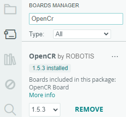

### Arduino
File -> Preference -> Additional Board Manager Url 부분에
```
https://raw.githubusercontent.com/ROBOTIS-GIT/OpenCR/master/arduino/opencr_release/package_opencr_index.json
```

### Libraries는 OpenCR 다운로드



### Ubuntu에서 Arduino 실행

https://www.arduino.cc/en/software 에서 Appimage 다운로드 후 ubuntu에서 실행

### USB Port Settings

```
$ wget https://raw.githubusercontent.com/ROBOTIS-GIT/OpenCR/master/99-opencr-cdc.rules
$ sudo cp ./99-opencr-cdc.rules /etc/udev/rules.d/
$ sudo udevadm control --reload-rules
$ sudo udevadm trigger
```

### RosSerial
```
1.ros_serial_arduni.ino 작성 및 빌드 / 업로드
----------------------------------
#include <ros.h>
#include <std_msgs/Int16.h>
ros::NodeHandle  nh;
void messageCb( const std_msgs::Int16& toggle_msg){
  int ledVal = toggle_msg.data;
  if(ledVal)
    digitalWrite(LED_BUILTIN, HIGH);   // turn the LED on (HIGH is the voltage level)
  else                                // wait for a second
    digitalWrite(LED_BUILTIN, LOW);    // turn the LED off by making the voltage LOW
  delay(1000);                       // wait for a second  
}
ros::Subscriber<std_msgs::Int16> sub("toggle_led", &messageCb );
void setup()
{ 
  pinMode(LED_BUILTIN, OUTPUT);
  nh.initNode();
 // nh.getHardware()->setBaud(57600);
  nh.subscribe(sub);
}

void loop()
{  
  nh.spinOnce();
  delay(1);
}
---------------------------------------------
2.ubuntu linux에서
리눅스 ros serial 패키지 설지
$ sudo apt-get install ros-noetic-rosserial ros-noetic-rosserial-server ros-noetic-rosserial-arduino

3. roscore 실행

4. ubuntu 로스시리얼 서버를 실행

ubuntu에 usb 시리얼 장치 추가 후
$ rosrun rosserial_python serial_node.py __name:=arduino _port:=/dev/ttyACM0 _baud:=57600

5. ubuntu에서 publisher 작성 및 빌드
패키지 이름 ros_seiral_topic, 
노드 명 ros_serial_node
토픽 명 toggle_led

$cm 

6. ros 노드 실행
$ rosrun ros_serial_topic ros_serial_uno
```
### [예제](../../Arduino/examples/ros_serial_arduino/)
---


## bot3gpio
```
1.ubuntu에서 ros service server와 client 작성 및 테스트 
/home/ubuntu/catkin_ws/src/bot3_kccistc_service

2. 저장 경로 ~/Arduino 디렉토리 저장
```
rbot3_gpio_server.ino 작성
```arduino
#include <ros.h>
#include <std_msgs/String.h>
#include "bot3gpio.h"

ros::NodeHandle nh;
using bot3_kccistc_service::bot3gpio;
int i = 0;
void callback(const bot3gpio::Request & req, bot3gpio::Response & res){
  res.result = req.a + req.b;
  Serial.print("req.a : ");
  Serial.print(req.a);
  Serial.print(", req.b : ");
  Serial.print(req.b);
  Serial.print(", res.result : ");
  Serial.print(res.result);
}
ros::ServiceServer<bot3gpio::Request, bot3gpio::Response> gpio_server("bot3gpio",&callback);
void setup() {
  Serial.begin(115200);
  nh.initNode();
  nh.advertiseService(gpio_server);
}
void loop() {
  nh.spinOnce();
  delay(1000);
}
```
---
```
3. 스케치 빌드시 아래 오류 발생
Compilation error: bot3gpio.h: No such file or directory

기존 리눅스 service 패키지 파일의 bot3gpio.h 생성
ubuntu@ubuntu08:~/Arduino$ mkdir libraries
ubuntu@ubuntu08:~/Arduino$ cd libraries
ubuntu@ubuntu08:~/Arduino/libraries$ rosrun rosserial_arduino make_libraries.py .
ubuntu@ubuntu08:~/Arduino/libraries$ cd ros_lib
ubuntu@ubuntu08:~/Arduino/libraries/ros_lib$ ls bot3_kccistc_service
bot3gpio.h

생성된 bot3gpio.h 파일을 아두이노 프로젝트 디렉토리로 이동
ubuntu@ubuntu08:~/Arduino/libraries/ros_lib$ mv bot3_kccistc_service/bot3gpio.h ~/Arduino/bot3_gpio_server

ubuntu@ubuntu08:~/Arduino $ rm -rf ros_lib/


4. 아두이노 시리얼 작동
5. ubuntu 로스시리얼 서버를 실행
  ubuntu에 usb 시리얼 장치 추가 후
$ rosrun rosserial_python serial_node.py __name:=arduino _port:=/dev/ttyACM0 _baud:=57600

6. rqt로 통신 확인
```

## Window Aruino
turtlebot3_core 예제 사용


- turtlebot3_core.ino 파일에
  ```Arduino
  nh.advertiseService(gpio_server); //for kccistc

  void gpioCallback(const bot3gpio::Request & req, bot3gpio::Response & res){
    res.result = req.a + req.b;
  } // 추가
  ```

- turtlebot3_core_config.h 파일에
  ```Arduino
  #include "bot3gpio.h" //for kccistc
  using bot3_kccistc_service::bot3gpio; //for kccistc

  void gpioCallback(const bot3gpio::Request & req, bot3gpio::Response & res); //for kccistc

  ros::ServiceServer<bot3gpio::Request, bot3gpio::Response> gpio_server("bot3_gpio_srv",&gpioCallback); //for kccistc
  ```

  ## ROS 소켓

  ```
  1. ubuntu에서
  $ roscore

  2. turtlebot에서 
  $ ./bringup.sh

  3. ubuntu에서

  $ ./iot_server 5000

  $ rosrun bot3_kccistc_service gpio_sockettoros 10.10.14.28 5000 CJW_ROS

  4. 실행 명령어
  [CJW_ROS]ACTION@0.27@0.15@0.99 초기위치
  [CJW_ROS]ACTION@5.1@-0.01@0.15
  [CJW_ROS]TURTLE
  ```
  #### bot3_kccistc_service/src에서 vi gpio_socketToROS에서
  ```
  strcat(name_msg, "[ALLMSG]TURTLEGO\n");

  이걸 활용하기 위해서
  ->
  
  sprintf(msg, "[%s]TURTLEGO\n",pArray[0]); 로 ALLMSG가 아닌 피드백을 구현
  ```

  #### turtlebot에서
  ```
  sudo apt install ros-noetic-move-base-msgs
  ```
  ```
  1.터틀봇 소스 패키지 설치(필요시) - rasberry pi
  ------------------------------------
  # workspace의 src 폴더로 이동
  $ cd:~/catkin_ws/src
  빌드 필요 패키지 설치
  $sudo apt install ros-noetic-urdf-geometry-parser  ros-noetic-interactive-markers ros-noetic-xacro
  소스 다운로드
  기존 turtlebot3 디렉토리 삭제 후 다운로드
  $ git clone -b noetic https://github.com/ROBOTIS-GIT/turtlebot3.git
  빌드
  $ cm
  $roslaunch turtlebot3_bringup turtlebot3_robot.launch


  2.LDS driver 설치
  $ 다운로드 https://github.com/ROBOTIS-GIT/hls_lfcd_lds_driver/tree/noetic-devel
  $ git clone -b noetic https://github.com/ROBOTIS-GIT/hls_lfcd_lds_driver.git
  $ cd ~/catkin_ws/src/hls_lfcd_lds_driver/applications/lds_driver
  lds_driver$ make
  lds_driver$ ./lds_driver
  
  vi .bashrc
  export LDS_MODEL=LDS-01

  LDS publisher 실행
  $ roslaunch hls_lfcd_lds_driver hlds_laser.launch
  ```

  #### 라이다 이용(turtlebot)
  ```
  $ sudo apt-get install ros-kinetic-hls-lfcd-lds-driver
  $ sudo chmod a+rw /dev/ttyUSB0

  (ubuntu에서 roscore 실행)

  $ roslaunch hls_lfcd_lds_driver hlds_laser.launch
  $ roslaunch hls_lfcd_lds_driver view_hlds_laser.launch

  ubuntu rqt에서 Topic = /scan, type = sensor_msgs/LaserScan 값들 확인

  이후

  ubuntu $ rospack find sensor_msgs
  /opt/ros/noetic/share/sensor_msgs/

  $ vi /opt/ros/noetic/share/sensor_msgs/msgs/LaserScan.msg

  $ rospack find std_msgs
  /opt/ros/noetic/share/std_msgs

  $ vi /opt/ros/noetic/share/std_msgs/msgs/Header.msg
  ```

