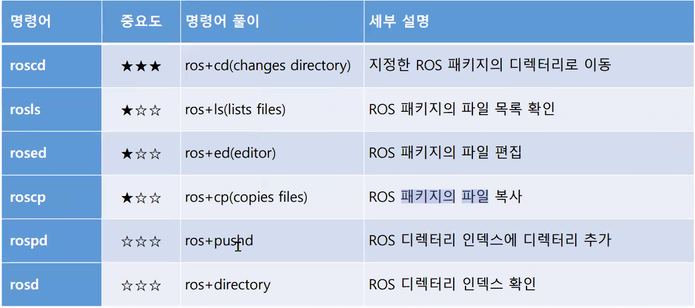
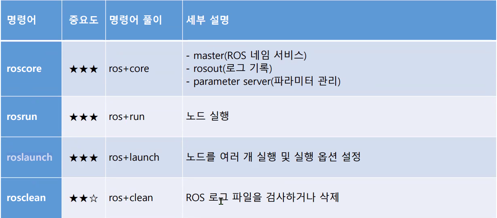

## ros

cat .bashrc
```
alias cw='cd ~/catkin_ws'
alias cs='cd ~/catkin_ws/src'
alias cm='cd ~/catkin_ws && catkin_make'
```

roscd turtlesim
```
cd /opt/ros/noetic/share/turtlesim
```

### 명령어 모음


### ros 실행명령어


```
$ roscore 

$ rosnode list
$ rostopic list

$ rosrun turtlesim turtlesim_node

$ rosrun turtlesim turtle_teleop_key

$ rostopic echo /turtle1/cmd_vel

$ rostopic echo /turtle1/pose

$ rostopic list -v

퍼블러셔 명령 1번 수행
$ rostopic pub -1 /turtle1/cmd_vel geometry_msgs/Twist -- '[0.5,0.0,0.0]' '[0.0,0.0,0.0]'

퍼블러셔 명령 1Hz 단위 명령 수행
$ rostopic pub  /turtle1/cmd_vel geometry_msgs/Twist -r 1 -- '[0.5,0.0,0.0]' '[0.0,0.0,1.0]'

$ rostopic hz /turtle1/cmd_vel     
	average  rate: 1.000   ==> 1Hz

터틀봇 3 

$ rostopic pub -1 /cmd_vel geometry_msgs/Twist -- '[0.05,0.0,0.0]' '[0.0,0.0,1.0]'

$ rostopic pub /cmd_vel geometry_msgs/Twist -r 1 -- '[0.1,0.0,0.0]' '[0.0,0.0,0.5]'


12.터틀봇 목적지 좌표값 출력
ubuntu@ubuntu00:~/ros$ rostopic echo /move_base/goal
p0지점
x:0
y:0
========================================
p1지점
header:
  seq: 0
  stamp:
    secs: 1736319928
    nsecs: 245587507
  frame_id: ''
goal_id:
  stamp:
    secs: 0
    nsecs:         0
  id: ''
goal:
  target_pose:
    header:
      seq: 0
      stamp:
        secs: 1736319928
        nsecs: 245318063
      frame_id: "map"
    pose:
      position:
        x: 8.880085945129395
        y: -0.032529067248106
        z: 0.0
      orientation:
        x: 0.0
        y: 0.0
        z: 0.6710057018155441
        w: 0.7414521887020289
========================================
p2 지점
header:
  seq: 1
  stamp:
    secs: 1736320029
    nsecs:  50458993
  frame_id: ''
goal_id:
  stamp:
    secs: 0
    nsecs:         0
  id: ''
goal:
  target_pose:
    header:
      seq: 1
      stamp:
        secs: 1736320029
        nsecs:  50138952
      frame_id: "map"
    pose:
      position:
        x: 9.042723655700684
        y: 2.7973885536193848
        z: 0.0
      orientation:
        x: 0.0
        y: 0.0
        z: -0.9999479539021359
        w: 0.010202425541605512
---
p3 지점
header:
  seq: 2
  stamp:
    secs: 1736320094
    nsecs: 164246472
  frame_id: ''
goal_id:
  stamp:
    secs: 0
    nsecs:         0
  id: ''
goal:
  target_pose:
    header:
      seq: 2
      stamp:
        secs: 1736320094
        nsecs: 164022214
      frame_id: "map"
    pose:
      position:
        x: 0.03252793848514557
        y: 2.992556095123291
        z: 0.0
      orientation:
        x: 0.0
        y: 0.0
        z: -0.7071067966408575
        w: 0.7071067657322372
---
p1 지점 이동 명령
ubuntu@ubuntu00:~/ros$ rostopic pub /move_base_simple/goal geometry_msgs/PoseStamped '{header: {stamp: now, frame_id: "map"}, pose: {position: { x: 8.8800, y: -0.0325, z: 0.67}, orientation: { w: 0.7414521887020289}}}'


header:
  seq: 1
  stamp:
    secs: 1736321146
    nsecs: 704575256
  frame_id: ''
goal_id:
  stamp:
    secs: 0
    nsecs:         0
  id: ''
goal:
  target_pose:
    header:
      seq: 1
      stamp:
        secs: 1736321146
        nsecs: 500630855
      frame_id: "map"
    pose:
      position:
        x: 8.88
        y: -0.0325
        z: 0.67
      orientation:
        x: 0.0
        y: 0.0
        z: 0.0
        w: 0.7414521887020289
---

===========================================
p2 지점 이동 명령
ubuntu@ubuntu00:~/ros$ rostopic pub /move_base_simple/goal geometry_msgs/PoseStamped '{header: {stamp: now, frame_id: "map"}, pose: {position: { x: 9.042723655700684, y: 2.7973885536193848, z: 0.0}, orientation: { w: 0.010202425541605512}}}'
header:
  seq: 2
  stamp:
    secs: 1736321331
    nsecs: 324753834
  frame_id: ''
goal_id:
  stamp:
    secs: 0
    nsecs:         0
  id: ''
goal:
  target_pose:
    header:
      seq: 1
      stamp:
        secs: 1736321331
        nsecs:  80515146
      frame_id: "map"
    pose:
      position:
        x: 9.042723655700684
        y: 2.7973885536193848
        z: 0.0
      orientation:
        x: 0.0
        y: 0.0
        z: 0.0
        w: 0.010202425541605512
===============================
p3 지점 이동 명령
ubuntu@ubuntu00:~/ros$ rostopic pub /move_base_simple/goal geometry_msgs/PoseStamped '{header: {stamp: now, frame_id: "map"}, pose: {position: { x: 0.03252793848514557, y: 2.992556095123291, z: 0.0}, orientation: { w: 0.7071067657322372}}}'


p0 지점 이동 명령
ubuntu@ubuntu00:~/ros$ rostopic pub /move_base_simple/goal geometry_msgs/PoseStamped '{header: {stamp: now, frame_id: "map"}, pose: {position: { x: 0.0, y: 0.0, z: 0.0}, orientation: { w: 0.7071067657322372}}}'

```
